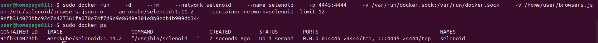
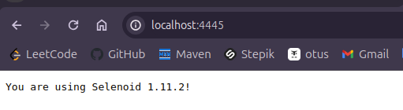

### Для запуска двух selenoid необходимо создать две сети
```dockerfile
sudo docker network create selenoid
```
```dockerfile
sudo docker network create selenoid1
```

```dockerfile
nano ./browsers.json
```

```dockerfile
sudo docker pull selenoid/chrome:121.0
```

```dockerfile
sudo docker run \
    -d \
    --rm \
    --network selenoid \
    --name selenoid \
    -p 4445:4444 \
    -v /var/run/docker.sock:/var/run/docker.sock \
    -v /home/it/browsers.json:/etc/selenoid/browsers.json:ro \
    aerokube/selenoid:1.11.2 \
    -container-network=selenoid -limit 12
```

```dockerfile
sudo docker run \
    -d \
    --rm \
    --network selenoid1 \
    --name selenoid1 \
    -p 4446:4444 \
    -v /var/run/docker.sock:/var/run/docker.sock \
    -v /home/it/browsers.json:/etc/selenoid/browsers.json:ro \
    aerokube/selenoid:1.11.2 \
    -container-network=selenoid1 -limit 12
```

### Должно получится вот так:


### Если на этом моменте не будет появляться запущенный контейнер, убрать опцию ```--rm```, и посмотреть логи контейнера


